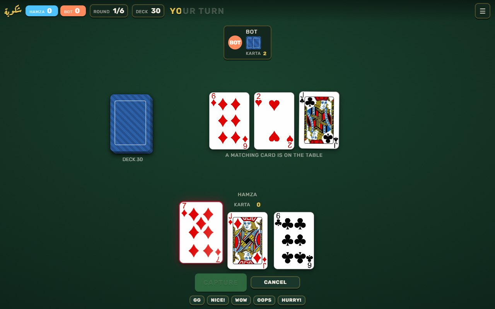
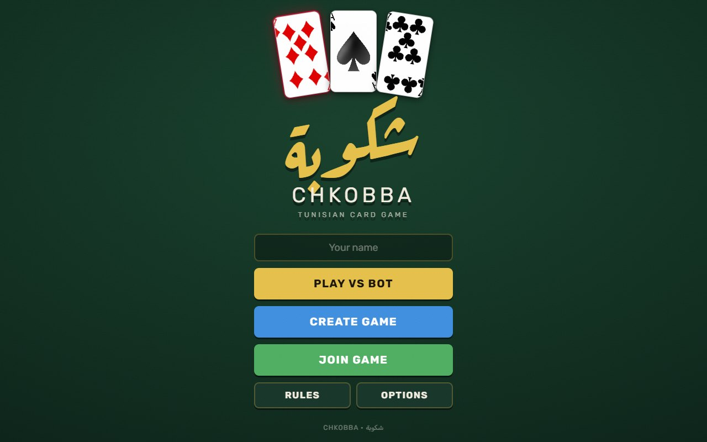
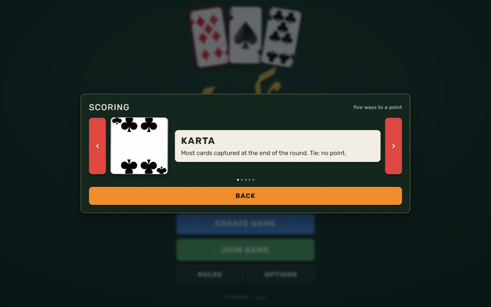
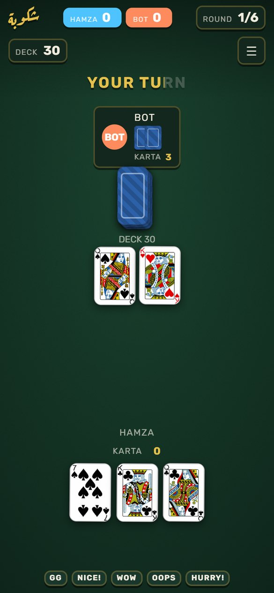

# Chkobba / شكوبة

**The classic Tunisian card game in the browser: play a bot offline, or share a link and play friends online in real time.**

A multiplayer browser implementation of **Chkobba** (شكوبة), the popular Tunisian card game. Online games sync through Firebase Realtime Database, so they work across any network with no game server to run. It is written in vanilla HTML, CSS and JavaScript with no build step, and it deploys to any static host (Netlify, Vercel, GitHub Pages).

<p align="center">
  
</p>

<p align="center">
  
  
</p>

<p align="center">
  
</p>

## Features

- **Play vs bot** with three difficulty levels (easy, medium, hard). Works offline, with no Firebase needed, and no name is required (you play as "Player"). A bot game is saved in the browser after every move, so a reload or a closed tab offers **Resume game** on the menu.
- **Online multiplayer** for 2 players, or 4 players in two teams. The host shares a room code or link, and empty seats can be filled with bots. If a player drops out mid-game, the host is told and can **wait** (the player rejoins with the same name and room code) or **claim the win**.
- **Room options:** win at 5, 11, 21 or 31 points; turn timer (off, or 10 to 60 s); game speed; force capture; capture assist.
- **Looks:** three themes (Felt, Balatro, Noir), three card styles (Photo, Flat, Pixel) and two suit sets (French, Coins). The host's choice applies to the whole room.
- **Personal settings:** screen shake, animations, sound, and labels in Latin, Arabic + Latin, or English.
- **Game feel:** animated deals, card flights, a "chkobba" slam effect, a scored round-end tally and emotes.
- **Card info panel:** long-press, right-click or press `i` on a face-up card to see its value, what it scores and what it can take right now.
- **Host debug panel** for testing: see all hands, the deck, force turns, deals and scores.

## Rules (summary)

- **Players:** 2 or 4. In 4-player mode, players 0+2 form **Team 1** and players 1+3 form **Team 2**.
- **Deck:** 40 cards (Ace to 7 plus Jack, Queen and King in each suit; no 8, 9 or 10).
- **Card values:** Ace = 1, 2 to 7 = face value, Queen = 8, Jack = 9, King = 10.
- **Deal:** the first deal puts 4 cards face up on the table and gives each player 3 cards. Later deals give 3 cards per player only.
- **Play:** on your turn, play one card. Either **place** it on the table, or **capture** table cards whose values add up to its value.
- **Equal card first:** if a table card has the same value as the card you play, you must take that card; a sum is only allowed when no equal card is on the table (7♥ 3♦ 4♣ on the table and a 7 in hand: the 7 takes 7♥, never 3♦+4♣). The host checks this for every move, including the bot's and online players', and a refused move lights up the card you have to take.
- **Force capture** (room option): while any card in your hand has an equal card on the table, you cannot place a card; you must take it.
- **Chkobba:** clearing the table with a capture scores +1 right away. The dealer cannot score a chkobba on the last card of a round.
- **Deals and rounds:** one round is a whole 40-card deck, played as several deals of 3 cards each (6 deals with 2 players, 3 with 4). The top bar shows the current deal, for example `DEAL 4/6`.
- **End of a deck:** when the hands are empty and the deck runs out, the remaining table cards go to the last team that captured.
- **Points per round:**
  - Most cards captured (*karta*): +1
  - Most diamonds (*dinari*): +1
  - The 7 of diamonds (*haya*): +1
  - Most sevens (*barmila*; tie goes to most sixes, tie again means no point): +1
  - Each chkobba: +1
- **Instant win:** capture all 10 diamonds in one round.
- **Winning:** the first team to reach the chosen score (5, 11, 21 or 31) wins.
- **Capture assist** (off by default): when the host turns it on, cards that can take something are outlined, the matching table cards are highlighted, and if only one take is possible it is picked for you. When it is off, you pick every card yourself and the Capture button lights up only when your picks add up.

### Tips

- Table cards **carry over** between deals. They are only cleared when the deck is empty.
- Double-click a hand card to place it directly (when no capture is required).
- Long-press, right-click or press `i` on a face-up card to open its info panel.

## How multiplayer sync works

There is no game server. One browser, the **host**, is the referee, and Firebase Realtime Database is the shared message bus.

```
 guest browser                    Firebase RTDB  rooms/<CODE>/                 host browser
 ─────────────                    ──────────────────────────                 ────────────
 push move ─────────────────────▶ moves/<pushId>  {playerId, cardId,  ──────▶ child_added:
                                                   captureCardIds, ts}         validate turn + card,
                                                                               apply rules, score,
 on('value') ◀──────────────────── state          (public: table, turn,  ◀──── write state
 on('value') ◀──────────────────── hand_<myId>     scores, deck count)   ◀──── write each hand
                                   players, host, log, emote
```

- **Host-authoritative state.** The host runs the game logic: dealing, turns, capture validation and scoring. A guest never changes the game state itself. It pushes a move to `rooms/<code>/moves`. The host listens with `child_added`, deletes each move node once it has read it, rejects moves that are out of turn or play a card the player does not hold, and then writes the new state back.
- **Split state.** The shared `state` node carries only public data: table cards, whose turn it is, scores, the deck *count* and the last move. Each hand is written to its own `hand_<i>` path, and each client subscribes only to its own hand.
- **Atomic seat claiming.** Joining uses a Firebase `transaction` on `players`, so two people joining at the same time cannot take the same seat. `onDisconnect()` frees a seat when a guest's connection drops.
- **Presence.** Every human seat writes `rooms/<code>/presence/<slot>` while it is connected (`onDisconnect` removes it, `.info/connected` re-arms it after a network blip). A seat that stays offline for more than 3 seconds counts as gone: the host gets a "wait or claim the win" prompt, and other players see a banner. A dropped player can rejoin a started game with the same name; strangers still cannot.
- **Stale-update protection.** Every game gets a `gameToken`, and every move increments `moveSeq`. Clients use these to ignore updates from an older game and to animate each move exactly once. Bot moves are scheduled with a delay and re-checked against the token and turn before they run.
- **Diff-driven rendering.** State updates can arrive several at a time. The renderer only marks the board as dirty. A render pump compares what is on screen with the latest state, plays the animation for the difference, then repaints. Pending renders collapse into the latest state.
- **Link-based joining.** The host shares a URL with `?room=XXXX` (or just the code), and players open it and join.

## Quick start

### Run locally

```bash
python -m http.server 8090
# or: npx http-server -p 8090
```

Then open <http://localhost:8090>. Without a `firebase-config.js`, only **Play vs bot** works, and the menu shows a notice. For online play, copy `firebase-config.example.js` to `firebase-config.js` and fill in your project's values (see below). A local `firebase-config.js` with an `emulator: { host, port }` entry points the app at the Realtime Database emulator.

### Set up Firebase

1. In the [Firebase Console](https://console.firebase.google.com/), create a project.
2. Add a **Realtime Database**. Do **not** leave it in "test mode": test mode lets anyone on the internet read every hand and overwrite any game. Publish the rules from `database.rules.json` instead (**Realtime Database → Rules → paste the file contents → Publish**).
3. Go to **Project Settings → General → Your apps → Add app → Web** and copy the `firebaseConfig` object.
4. Put it in `firebase-config.js` for local use. For Netlify, use environment variables (see below).

## Deploy

The repo includes a `netlify.toml`:

1. Import the repo on [Netlify](https://app.netlify.com/) (**Add new site → Import an existing project**).
2. Set these environment variables: `FIREBASE_apiKey`, `FIREBASE_authDomain`, `FIREBASE_databaseURL`, `FIREBASE_projectId`, `FIREBASE_storageBucket`, `FIREBASE_messagingSenderId`, `FIREBASE_appId`, and optionally `FIREBASE_measurementId`.
3. Deploy. The build command (`node scripts/generate-config.js`) writes `firebase-config.js` from those variables and publishes the repo root as a static site. `netlify.toml` also sets basic security headers (`X-Frame-Options`, `X-Content-Type-Options`, `Referrer-Policy`).

Any other static host works too, as long as it serves a `firebase-config.js`.

## Security note

The Firebase web config (`apiKey`, `databaseURL`, etc.) is sent to every browser and is **not a secret**. It identifies the project but does not grant access. Access is controlled by the database rules in `database.rules.json`: global reads and writes are denied, only `rooms/<code>` is reachable, and move payloads are validated.

Known limits, documented honestly in [`docs/AUDIT.md`](docs/AUDIT.md):

- A client that knows a room code can still read another player's `hand_i` directly. True at-rest hand privacy needs Firebase Anonymous Auth and per-user rules.
- The host is a browser, so a modified host client could cheat. Real cheat resistance would need server-side authority (for example Cloud Functions).

## Project structure

```
chkoba/
├── index.html                # Single-page app: menu, options, join, waiting room, game, overlays
├── game.js                   # Host authority, Firebase networking and presence, bots, bot-game save, render queue + animation
├── css/
│   ├── tokens.css            # Design tokens and the three themes (html[data-theme])
│   ├── game.css              # Layout, frames and pills, cards, text-fill, effects, overlays
│   └── debug.css             # Host debug panel and banners
├── js/
│   ├── rules.js              # Pure rules: legal captures, move check, bot move, round scoring (browser + Node)
│   ├── i18n.js               # Labels (Latin / Arabic / English) and rule text
│   ├── shader.js             # WebGL swirl background (themes that use one)
│   ├── fire.js               # Pixel fire for the chkobba slam and the tally
│   ├── juice.js              # Motion: tags, slam, flights, count-ups, shake, text-fill, sounds
│   ├── cards.js              # Card renderer: photo / flat / pixel, French or coin suits
│   └── look.js               # Room look (host-owned) and personal comfort settings
├── images/                   # 40 PNG card faces ({name}_of_{suit}[2].png; face cards use the "2" suffix)
├── firebase-config.example.js
├── database.rules.json       # Realtime Database security rules
├── netlify.toml              # Build command + security headers
├── scripts/generate-config.js
├── tests/rules.test.js       # node:test unit tests for js/rules.js
├── experimentals/            # Standalone UI lab used to design the current look (no Firebase)
└── docs/
    ├── AUDIT.md              # Code and security audit
    └── screenshots/
```

### Key design decisions

- **Firebase Realtime Database instead of WebRTC/PeerJS:** no NAT problems and no signaling server to deploy. Firebase handles real-time sync over WebSockets and reconnects automatically.
- **Host-authoritative logic in the browser:** no backend to run or pay for. The trade-offs are listed in the security note above.
- **Multi-deck matches with cumulative scores:** full 40-card decks are played one after another, reshuffled each time, until a team reaches the target score.

## Tests

The capture rules, the bot's move choice and the round scoring live in `js/rules.js`, a pure module with no DOM or Firebase. The browser loads it as `window.ChkobaRules`; Node can `require` it. Run the unit tests (Node 18 or newer, no install needed):

```bash
node --test
```

## Debug mode

The host can open the debug panel by running `debug()` in the browser console (press `Esc` to close it). Add `?debug=1` to the URL, or set `localStorage.chkoba_debug = "true"`, to turn on verbose logging. The panel is draggable and lets you:

- See every player's hand, the table and the deck
- Move cards between hands and the table, or swap hands
- Set, skip or pause turns
- Set scores and chkobba counts
- Force a deal, force scoring, or force a win for either team
- Toggle force capture, add or remove bots, and reset the game

## Tech stack

| Layer | Technology |
|-------|-----------|
| UI | Vanilla HTML + CSS (custom design tokens, three themes), WebGL background shader |
| Logic | Vanilla JavaScript (no framework, no build step) |
| Realtime sync | [Firebase Realtime Database](https://firebase.google.com/products/realtime-database) (compat SDK) |
| Hosting | Any static host; Netlify config included |

## License

© 2026 Hamza Ben Ismail. All rights reserved.
